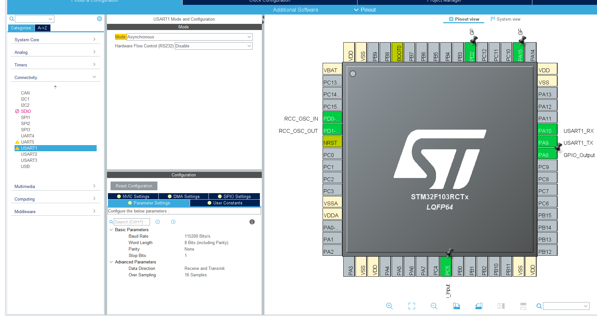
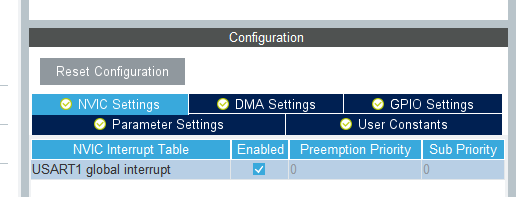

# Universal synchronous asynchronous receiver transmitter

The universal synchronous asynchronous receiver transmitter (USART) offers a flexible means of full-duplex data exchange with external equipment requiring an industry standard NRZ asynchronous serial data format. It is a protocol of serial communication and support both synchronous and asynchronous transmission. In asynchronous mode, a USART bidirectional communication needs two pins: receive data in(RX) and transmit data out(TX). In synchronous mode, an addition pin(SCLK) for clock synchronous is needed. In most cases, we use USART in asynchronous mode, which is UART, and only UART is involved in the following lab.

## Configure UART in STM32CubeIDE



- Choose any USART/UART you like and set its mode as asynchronous. Be caution of these four parameter: baud rate, word length, parity and stop bits. Two UARTs only work well when these four fields are the same.

## Transmit and Receive Data in Blocking Mode

```c
HAL_StatusTypeDef HAL_UART_Transmit(UART_HandleTypeDef *huart, uint8_t *pData, uint16_t Size, uint32_t Timeout)
HAL_StatusTypeDef HAL_UART_Receive(UART_HandleTypeDef *huart, uint8_t *pData, uint16_t Size, uint32_t Timeout)
```

These two functions is used to transmit/receive data in blocking mode. Which means, unless transmit/receive is completed or timeout, the programs will stop here. In most case, we transmit data in blocking mode, but receive the data by interruption

## Receive Data in Non-blocking Mode

Back to the configuration part, enable the interruption for the corresponding UART and re-generate the code.



- Enable the interruption to handle the case of receive data

In **main.c**, we need to call

```c
HAL_StatusTypeDef HAL_UART_Receive_IT(UART_HandleTypeDef *huart, uint8_t *pData, uint16_t Size)
```

```c
/* USER CODE BEGIN PV */
uint8_t rxBuffer[20];
/* USER CODE END PV */
//...
int main(void)
{
  //...
  /* USER CODE BEGIN 2 */
  HAL_UART_Receive_IT(&huart1, (uint8_t *)rxBuffer, 1);
  /* USER CODE END 2 */
  //...
}
```

which can receive data in non-blocking mode and trigger an interruption.

When there is a interruption of UART coming, the program will go into this function:

```c
/**
  * @brief This function handles USART1 global interrupt.
  */
void USART1_IRQHandler(void)
{
  /* USER CODE BEGIN USART1_IRQn 0 */

  /* USER CODE END USART1_IRQn 0 */
  HAL_UART_IRQHandler(&huart1);
  /* USER CODE BEGIN USART1_IRQn 1 */

  /* USER CODE END USART1_IRQn 1 */
}
```

```c
/**
  * @brief  This function handles UART interrupt request.
  * @param  huart  Pointer to a UART_HandleTypeDef structure that contains
  *                the configuration information for the specified UART module.
  * @retval None
  */
void HAL_UART_IRQHandler(UART_HandleTypeDef *huart)
{
  uint32_t isrflags   = READ_REG(huart->Instance->SR);
  uint32_t cr1its     = READ_REG(huart->Instance->CR1);
  uint32_t cr3its     = READ_REG(huart->Instance->CR3);
  uint32_t errorflags = 0x00U;
  uint32_t dmarequest = 0x00U;

  /* If no error occurs */
  errorflags = (isrflags & (uint32_t)(USART_SR_PE | USART_SR_FE | USART_SR_ORE | USART_SR_NE));
  if (errorflags == RESET)
  {
    /* UART in mode Receiver -------------------------------------------------*/
    if (((isrflags & USART_SR_RXNE) != RESET) && ((cr1its & USART_CR1_RXNEIE) != RESET))
    {
      UART_Receive_IT(huart);
      return;
    }
  }
  ...
 }
```

When the interruption is receive interruption, the program will call the function ``static HAL_StatusTypeDef UART_Receive_IT(UART_HandleTypeDef *huart)``, which store the character into the buffer ``pRxBuffPtr`` and call the receive complete callback function ``HAL_UART_RxCpltCallback`` when it receive ``RxXferCount`` amounts of characters.

So we can rewrite the ``HAL_UART_RxCpltCallback`` function if we want to receive data in non-blocking mode. For example, we can store the data in a array and sent it out when receive a line:

```c
void HAL_UART_RxCpltCallback(UART_HandleTypeDef *huart)
{
  if(huart->Instance==USART1)
  {
    static unsigned char uRx_Data[1024] = {0};
    static unsigned char uLength = 0;
    if(rxBuffer[0] == '\n')
    {
      HAL_UART_Transmit(&huart1, uRx_Data, uLength, 0xffff);
      uLength  = 0;
    }
    else
    {
      uRx_Data[uLength] = rxBuffer[0];
      uLength++;
    }
  }
}
```

And don't forget to re-call ``HAL_UART_Receive_IT`` to receive data continuously:

```c
void USART1_IRQHandler(void)
{
  /* USER CODE BEGIN USART1_IRQn 0 */

  /* USER CODE END USART1_IRQn 0 */
  HAL_UART_IRQHandler(&huart1);
  /* USER CODE BEGIN USART1_IRQn 1 */
  HAL_UART_Receive_IT(&huart1, (uint8_t *)rxBuffer, 1);
  /* USER CODE END USART1_IRQn 1 */
}
```
