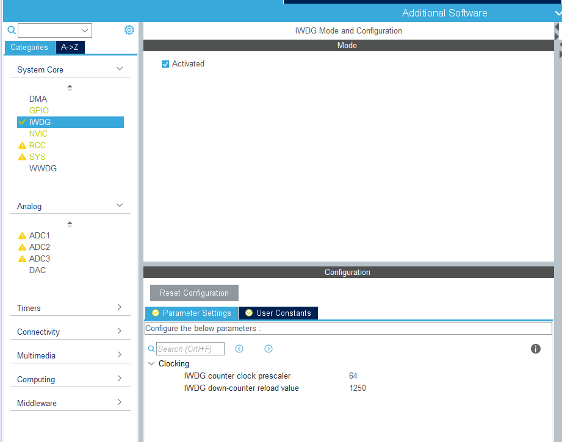
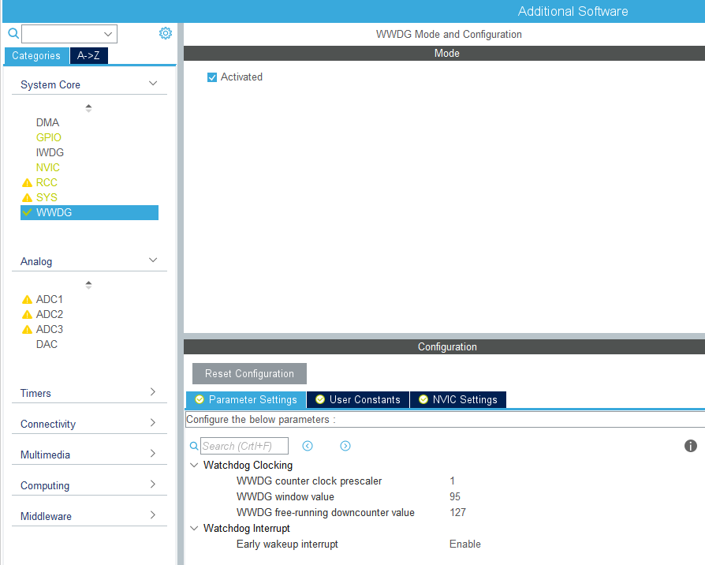
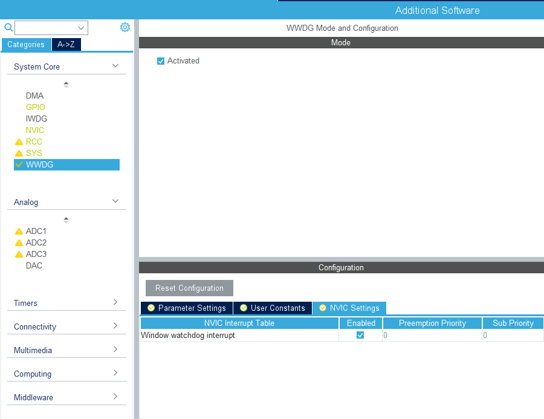

# Watchdog

A watchdog timer, usually simplified as watchdog, is an electronic timer that used to detect the device fault and reset the device to recover it when there is a fault. It is widely used in embedded systems. There is a down counter in a watchdog timer. The system will restart when the counter counts to a reload value. In normal case, a system should reflash the counter of watchdog periodically to maintain the system not to be restart. If the system has fault and cannot refresh the counter periodically, it will count to reload value and restart the system. There are two watchdogs in the STM32: indenpendent watchdog(IWDG) and the window watchdog(WWDG). The IWDG is clocked by its own dedicated low-speed clock(LSI) and thus stays active even if the main clock fails. The counter of IWDG is start from 0xFFF and reset the MCU when the counter reach 0x000. The window watchdog (WWDG) clock is prescaled from the APB1 clock and has a configurable time-window that can be programmed to detect abnormally late or early application behavior, which means the act of reflash the counter must in the time-window, otherwise it will cause a reset of the MCU. The lower bound of the window is 0x4F, while the upper bound of the window is configured by user. In addition, the WWDG has a early wakeup interrupt, which is triggered when the counter reach 0x40.

## Configure UART in STM32CubeIDE

### IWDG

Active the IWDG and set the prescaler and reload value.

**T_out = presaler * reload / freq**

The freq of STM32RCT6 LSI is 40Hz



#### API

Use the following function to refresh the IWDG

```c
/**
  * @brief  Refresh the IWDG.
  * @param  hiwdg  pointer to a IWDG_HandleTypeDef structure that contains
  *                the configuration information for the specified IWDG module.
  * @retval HAL status
  */
HAL_StatusTypeDef HAL_IWDG_Refresh(IWDG_HandleTypeDef *hiwdg)
{
  /* Reload IWDG counter with value defined in the reload register */
  __HAL_IWDG_RELOAD_COUNTER(hiwdg);

  /* Return function status */
  return HAL_OK;
}
```


Configure the external interrupt, and refresh the watchdog by pressing the KEY1

```c
  int i = 1;
  while (1)
  {
    /* USER CODE END WHILE */

    /* USER CODE BEGIN 3 */
  	i++;
  	sprintf(msg, "%d\r\n", i);
  	HAL_UART_Transmit(&huart1, (uint8_t*)msg, strlen(msg), HAL_MAX_DELAY);
  	HAL_Delay(1000);
  }
```

```c
void HAL_GPIO_EXTI_Callback(uint16_t GPIO_Pin)
{
  HAL_Delay(100);
  switch (GPIO_Pin) {
	case KEY1_Pin:
      if (HAL_GPIO_ReadPin(KEY1_GPIO_Port, KEY1_Pin) == GPIO_PIN_RESET) {
      	HAL_IWDG_Refresh(&hiwdg);
      }
	  break;
	default:
      break;
  }
}

```

Compile and program it into the MCU. When press the KEY1 continuously, the output will increase, otherwise, it will back to 1.


### WWDG

Active the WWDG, set the prameters of watchdog clocking and enable the early wakeup interrupt.

The method of calculating the time of WWDG is similar to IWDG. The WWDG window value is the upper bound of the window, while the WWDG free-running downcounter value is the reload value in IWDG.






#### API

Use the following function to refresh the WWDG

```c
/**
  * @brief  Refresh the WWDG.
  * @param  hwwdg  pointer to a WWDG_HandleTypeDef structure that contains
  *                the configuration information for the specified WWDG module.
  * @retval HAL status
  */
HAL_StatusTypeDef HAL_WWDG_Refresh(WWDG_HandleTypeDef *hwwdg)
{
  /* Write to WWDG CR the WWDG Counter value to refresh with */
  WRITE_REG(hwwdg->Instance->CR, (hwwdg->Init.Counter));

  /* Return function status */
  return HAL_OK;
}
```

Since we enable the early wakeup interrupt, we can find the following codes in **stm32f1xx_it.c**

```c
/**
  * @brief This function handles Window watchdog interrupt.
  */
void WWDG_IRQHandler(void)
{
  /* USER CODE BEGIN WWDG_IRQn 0 */

  /* USER CODE END WWDG_IRQn 0 */
  HAL_WWDG_IRQHandler(&hwwdg);
  /* USER CODE BEGIN WWDG_IRQn 1 */

  /* USER CODE END WWDG_IRQn 1 */
}
```

Jump to ``HAL_WWDG_IRQHandler``:

```c
/**
  * @brief  Handle WWDG interrupt request.
  * @note   The Early Wakeup Interrupt (EWI) can be used if specific safety operations
  *         or data logging must be performed before the actual reset is generated.
  *         The EWI interrupt is enabled by calling HAL_WWDG_Init function with
  *         EWIMode set to WWDG_EWI_ENABLE.
  *         When the downcounter reaches the value 0x40, and EWI interrupt is
  *         generated and the corresponding Interrupt Service Routine (ISR) can
  *         be used to trigger specific actions (such as communications or data
  *         logging), before resetting the device.
  * @param  hwwdg  pointer to a WWDG_HandleTypeDef structure that contains
  *                the configuration information for the specified WWDG module.
  * @retval None
  */
void HAL_WWDG_IRQHandler(WWDG_HandleTypeDef *hwwdg)
{
  /* Check if Early Wakeup Interrupt is enable */
  if (__HAL_WWDG_GET_IT_SOURCE(hwwdg, WWDG_IT_EWI) != RESET)
  {
    /* Check if WWDG Early Wakeup Interrupt occurred */
    if (__HAL_WWDG_GET_FLAG(hwwdg, WWDG_FLAG_EWIF) != RESET)
    {
      /* Clear the WWDG Early Wakeup flag */
      __HAL_WWDG_CLEAR_FLAG(hwwdg, WWDG_FLAG_EWIF);

#if (USE_HAL_WWDG_REGISTER_CALLBACKS == 1)
      /* Early Wakeup registered callback */
      hwwdg->EwiCallback(hwwdg);
#else
      /* Early Wakeup callback */
      HAL_WWDG_EarlyWakeupCallback(hwwdg);
#endif
    }
  }
}
```

When the early wakeup interruption is enable, it will call ``HAL_WWDG_EarlyWakeupCallback``, which is a weak function:

```c
/**
  * @brief  WWDG Early Wakeup callback.
  * @param  hwwdg : pointer to a WWDG_HandleTypeDef structure that contains
  *                the configuration information for the specified WWDG module.
  * @retval None
  */
__weak void HAL_WWDG_EarlyWakeupCallback(WWDG_HandleTypeDef *hwwdg)
{
  /* Prevent unused argument(s) compilation warning */
  UNUSED(hwwdg);

  /* NOTE: This function should not be modified, when the callback is needed,
           the HAL_WWDG_EarlyWakeupCallback could be implemented in the user file
   */
}
```

We should reimplement this function. In this example, we refresh the WWDG in it, but in real case, we should record some critical informations, rather than refresh the WWDG. When the realy wakeup interrupt is trigger, the system has software fault already. Let the interrupt finishs in 1 cycle, because the interrupt is trigged when the counter is 0x40 while the MCU is reseted when the counter is 0x3F.

```c
void HAL_WWDG_EarlyWakeupCallback(WWDG_HandleTypeDef *hwwdg)
{
	HAL_WWDG_Refresh(hwwdg);
}
```

The code of while routine can be kept the same;

```c
  int i = 1;
  while (1)
  {
    /* USER CODE END WHILE */

    /* USER CODE BEGIN 3 */
  	i++;
  	sprintf(msg, "%d\r\n", i);
  	HAL_UART_Transmit(&huart1, (uint8_t*)msg, strlen(msg), HAL_MAX_DELAY);
  	HAL_Delay(1000);
  }
```

Compile and program it into the MCU.


## Practice

Try to use timer to refresh the IWDG

## Assignment

1. Use the ADC to get the measurement of internal temperature sensor(practice of the last lab)
2. Use KEY1 to refresh the WWDG and output the corresponding data when the early wakeup interrupt is triggered.
3. Due on November 20th