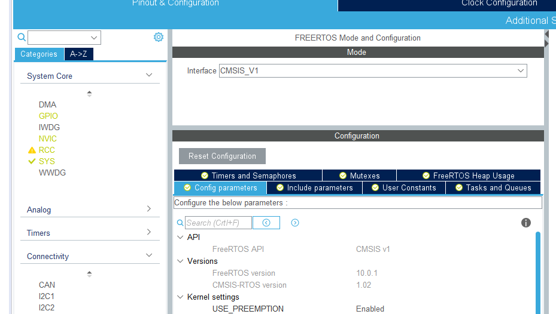
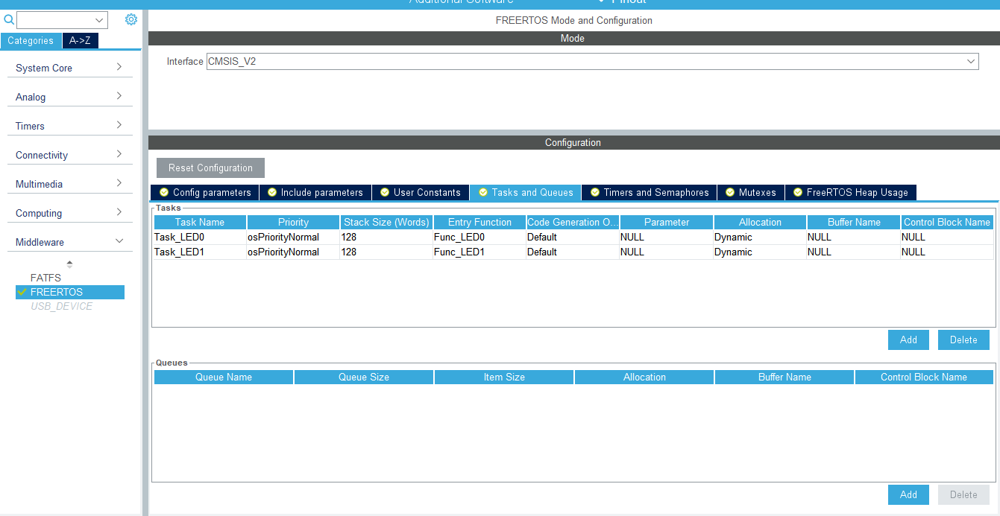
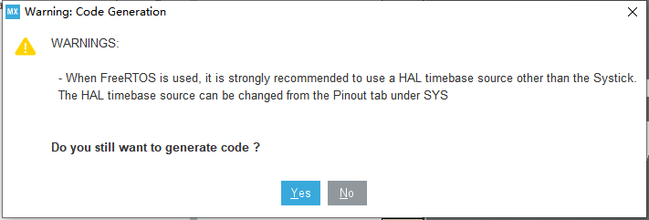
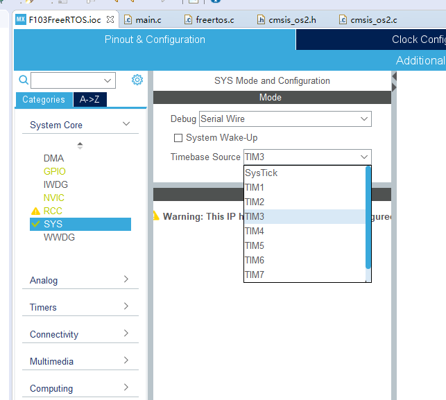

# FreeRTOS

## Introduction

A real-time operating system(RTOS) is an operating system(OS) intended to serve real-time applications that process data as it comes in, typically without buffer delays, which is a time bound system which has well defined fixed time constraints. Process in the RTOS must be done within the defined constraints, otherwise, the system will fail. Most of the operating systems are multi-tasking, which allow more than one program to be running in concurrency. This is achieved by time-sharing, where the available processor time is divided into multiple processes. These processes are each interrupted repeatedly in time slices by a task-scheduling subsystem of the operating system. In typical designs, a task has three states:

1. Running(executing on the CPU)
2. Ready(ready to be executed)
3. Blocked(waiting for an event, I/O for example)

Most tasks are blocked or ready most of the time because generally only one task can run at a time in one CPU. Since tasks are scheduled in turn in a small time slice, it seems that there are multiple tasks run simultaneously.

FreeRTOS is a free, open source RTOS for embedded devices, which has been ported to 35 microcontroller platforms. For embedded devices, there are many RTOS, like μC/OS-Ⅱ and WinCE. Alibaba, Tencent and Huawei also have their own RTOS, which is build for their own IoT cloud platforms. We choose FreeRTOS is because it is integrated into the STM32CubeIDE, which is easy to configure.

This document only mentions how to achieve a simple multi-task program by FreeRTOS.

## Configuration on STM32CubeIDE

Enable **FREERTOS** in the **Middleware** categories and set the FreeRTOS API as CMSIS v1.



Go to the **Tasks and Queues**, and add two tasks.



It seems everything is done. Let’s try to generate the code:



It is because the HAL has its own timebase which uses for timeout detection. It originally uses Systick but Systick is occupied by FreeRTOS. So, we need to change the timebase source to a timer, for example, TIM3.



Now we can generate the code.

In the main routine of the **main.c** file, we find that there are two functions are called but we didn’t meet in the previous lab: ``MX_FREERTOS_Init()`` and ``osKernelStart()``

```c
void MX_FREERTOS_Init(void) {
  /* USER CODE BEGIN Init */
       
  /* USER CODE END Init */
osKernelInitialize();

  /* USER CODE BEGIN RTOS_MUTEX */
  /* add mutexes, ... */
  /* USER CODE END RTOS_MUTEX */

  /* USER CODE BEGIN RTOS_SEMAPHORES */
  /* add semaphores, ... */
  /* USER CODE END RTOS_SEMAPHORES */

  /* USER CODE BEGIN RTOS_TIMERS */
  /* start timers, add new ones, ... */
  /* USER CODE END RTOS_TIMERS */

  /* USER CODE BEGIN RTOS_QUEUES */
  /* add queues, ... */
  /* USER CODE END RTOS_QUEUES */

  /* Create the thread(s) */
  /* definition and creation of Task_LED0 */
  const osThreadAttr_t Task_LED0_attributes = {
    .name = "Task_LED0",
    .priority = (osPriority_t) osPriorityNormal,
    .stack_size = 128
  };
  Task_LED0Handle = osThreadNew(Func_LED0, NULL, &Task_LED0_attributes);

  /* definition and creation of Task_LED1 */
  const osThreadAttr_t Task_LED1_attributes = {
    .name = "Task_LED1",
    .priority = (osPriority_t) osPriorityNormal,
    .stack_size = 128
  };
  Task_LED1Handle = osThreadNew(Func_LED1, NULL, &Task_LED1_attributes);

  /* USER CODE BEGIN RTOS_THREADS */
  /* add threads, ... */
  /* USER CODE END RTOS_THREADS */

}
```

``MX_FREERTOS_Init()`` initialize the OS kernel and create two tasks, which bind the thread and its function, while ``osKernelStart()`` starts the task-scheduler. Don’t add codes in the while routine, because the PC cannot reach them.

Find ``Func_LED0`` and ``Func_LED1`` in the **freertos.c** and implement them.

```c
/* USER CODE BEGIN Header_Func_LED0 */
/**
  * @brief  Function implementing the Task_LED0 thread.
  * @param  argument: Not used 
  * @retval None
  */
/* USER CODE END Header_Func_LED0 */
void Func_LED0(void *argument)
{
  /* USER CODE BEGIN Func_LED0 */
  /* Infinite loop */
  for(;;)
  {
    HAL_GPIO_TogglePin(LED0_GPIO_Port, LED0_Pin);
    osDelay(500);
  }
  /* USER CODE END Func_LED0 */
}

/* USER CODE BEGIN Header_Func_LED1 */
/**
* @brief Function implementing the Task_LED1 thread.
* @param argument: Not used
* @retval None
*/
/* USER CODE END Header_Func_LED1 */
void Func_LED1(void *argument)
{
  /* USER CODE BEGIN Func_LED1 */
  /* Infinite loop */
  for(;;)
  {
    HAL_GPIO_TogglePin(LED1_GPIO_Port, LED1_Pin);
    osDelay(500);
  }
  /* USER CODE END Func_LED1 */
}
```

``osDelay`` is used to block the task, and execute the task in 500 milliseconds. It acts like ``HAL_Delay`` but they are different. When ``HAL_Delay`` is called, CPU cannot do anything except waiting, while ``osDelay`` just suspend the current task, and CPU can execute other task when the pervious task is blocked.

Compile and program the code into the MCU, you can see two LED blink at the same time.