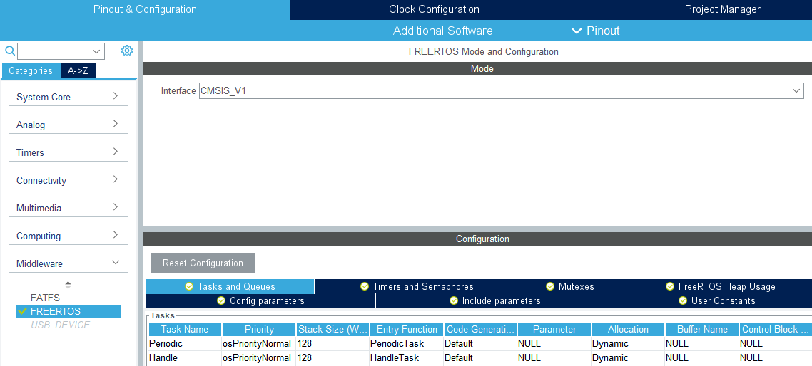
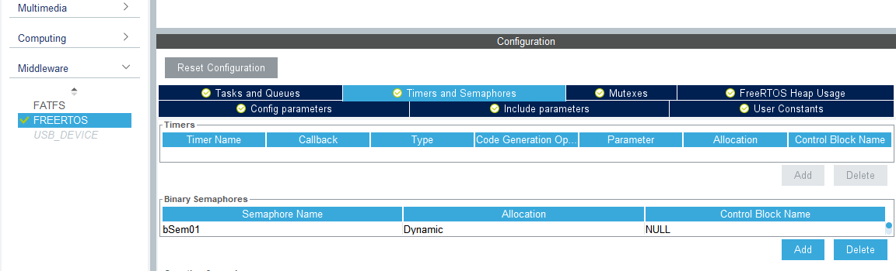
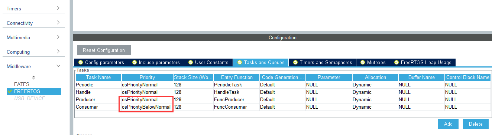
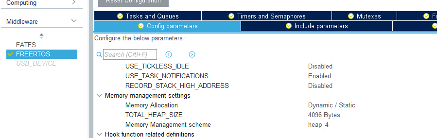
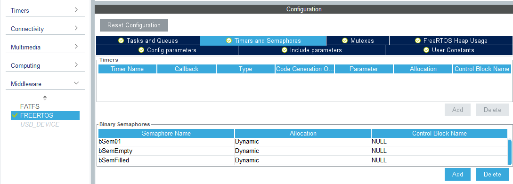
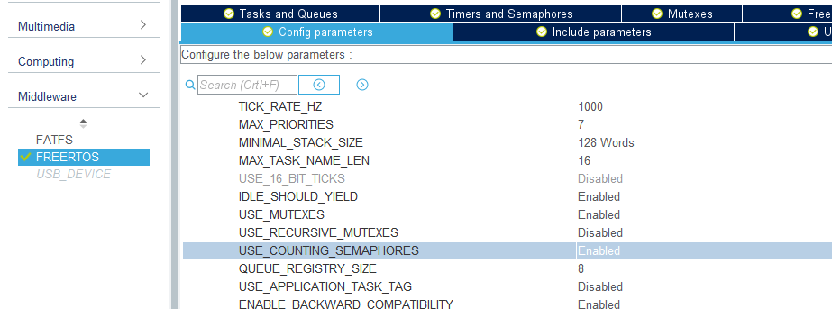
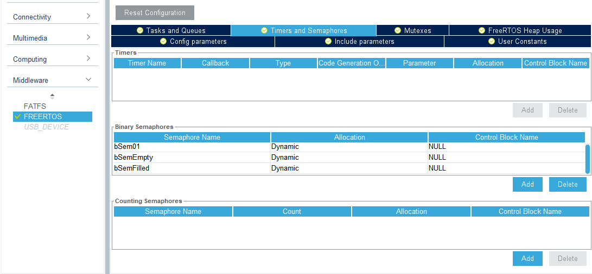

# FreeRTOS-Semaphore

## Introduction

In multitasking operating system, a semaphore is a variable used to control the access to a common resource by multiple processes. The value of semaphore represents the number of available resources. Semaphores are equipped with two operations: **P** and **V**. Operation V increments the semaphore, while operation P decrements it. When operation P is executed but the semaphore value is zero, the task executing it will be blocked and wait until the semaphore value is bigger than zero. The detail of semaphores and its operations will be introduced in Prof. Tang's operating system course in the next semester. You can also check this [link](https://www.geeksforgeeks.org/semaphores-in-process-synchronization/) for more explanations. I just illustrate it briefly by the following examples:

Imaging that there is a parking lot with ten parking spaces, which means this parking lot can contain ten vehicles. We regard the parking lot as a semaphore with the value 10 and vehicles as the tasks. A vehicle come into the parking lot means a operation P, while a vehicle go out from the parking lot means a operation V. At the beginning, the parking lot is empty. Vehicles come into the parking lot, do operation P and occupy the parking spaces. When the parking lot is full, the value of semaphore is zero. If there is a vehicle wants to come into the parking lot and do the operation P, it has to wait outside until there is a vehicle goes out from the parking lot and does operation V.

Semaphores which allow an arbitrary resource count are called counting semaphores, while semaphores which are restricted to the values 0 and 1 (or locked/unlocked, unavailable/available) are called binary semaphores and are used to implement mutex locks.

## Configuration on STM32CubeIDE

### Binary Semaphore 



Create two tasks with the name **Periodic** and **Handle**.



Go to the **Timers and Semaphores** tab and add a binary semaphores named bSem01.

Generate the code and implement the function **PeriodicTask** and **HandleTask**.

```c
/* USER CODE BEGIN Header_PeriodicTask */
/**
  * @brief  Function implementing the Periodic thread.
  * @param  argument: Not used 
  * @retval None
  */
/* USER CODE END Header_PeriodicTask */
void PeriodicTask(void const * argument)
{
  /* USER CODE BEGIN PeriodicTask */
  /* Infinite loop */
  for(;;)
  {
    osDelay(1000);
    osSemaphoreRelease(bSem01Handle);
  }
  /* USER CODE END PeriodicTask */
}

/* USER CODE BEGIN Header_HandleTask */
/**
* @brief Function implementing the Handle thread.
* @param argument: Not used
* @retval None
*/
/* USER CODE END Header_HandleTask */
void HandleTask(void const * argument)
{
  /* USER CODE BEGIN HandleTask */
  /* Infinite loop */
  for(;;)
  {
    osSemaphoreWait(bSem01Handle, osWaitForever);
    HAL_GPIO_TogglePin(LED0_GPIO_Port, LED0_Pin);
    HAL_GPIO_TogglePin(LED1_GPIO_Port, LED1_Pin);
  }
  /* USER CODE END HandleTask */
}
```

Since **bSem01** is a binary semaphore, ``osSemaphoreWait`` can be executed once and the Handle task will be blocked  because the value of semaphore is zero. It won’t wake up until Periodic task does operation V.

#### Producer–consumer problem

[Producer–consumer problem](https://en.wikipedia.org/wiki/Producer%E2%80%93consumer_problem) is a classical multi-process synchronization problem in operation system. If the buffer size is one, we can use binary semaphore to solve this problem.

Back to configuration and add two more tasks:



Remember to set the priority of the Consumer task as **osPriorityBelowNormal**, which will make sure the Producer task will be executed before the Consumer task.



We have added two more tasks but too small avaliable heap size will cause unexpected problems. Go to the **Config parameters** tab to increase the **TOTAL_HEAP_SIZE** to 4096Bytes.



Add two more semaphores named **bSemEmpty** and **bSemFilled** and generate the code.

Find ``FuncProducer`` and ``FuncConsumer`` in the **freertos.c** and implement them.

```c
/* USER CODE BEGIN Header_FuncProducer */
/**
* @brief Function implementing the Producer thread.
* @param argument: Not used
* @retval None
*/
/* USER CODE END Header_FuncProducer */
void FuncProducer(void const * argument)
{
  /* USER CODE BEGIN FuncProducer */
  /* Infinite loop */
  for(;;)
  {
    osSemaphoreWait(bSemEmptyHandle, osWaitForever);
    sprintf(msg, "Producer produce data\r\n");
    HAL_UART_Transmit(&huart1, (uint8_t*)msg, strlen(msg), HAL_MAX_DELAY);
    HAL_Delay(500);
    osSemaphoreRelease(bSemFilledHandle);
  }
  /* USER CODE END FuncProducer */
}

/* USER CODE BEGIN Header_FuncConsumer */
/**
* @brief Function implementing the Consumer thread.
* @param argument: Not used
* @retval None
*/
/* USER CODE END Header_FuncConsumer */
void FuncConsumer(void const * argument)
{
  /* USER CODE BEGIN FuncConsumer */
  /* Infinite loop */
  for(;;)
  {
    osSemaphoreWait(bSemFilledHandle, osWaitForever);
    sprintf(msg, "Consumer consume data\r\n");
    HAL_UART_Transmit(&huart1, (uint8_t*)msg, strlen(msg), HAL_MAX_DELAY);
    HAL_Delay(500);
    osSemaphoreRelease(bSemEmptyHandle);
  }
  /* USER CODE END FuncConsumer */
}
```

### Counting Semaphore

To use counting semaphore, enable it in the **Config parameters** tab:



And add counting semaphore in the **Timers and Semaphores** tab:




## Practice

Suppose the buffer size of the Producer–consumer problem is 4. Try to use counting semaphore to solve it. Remember to set the priority of the Consumer task as **osPriorityBelowNormal** to make sure the Producer task executed first. Try to figure out what the output should be and why before running the program, and compare it with the actual output.

